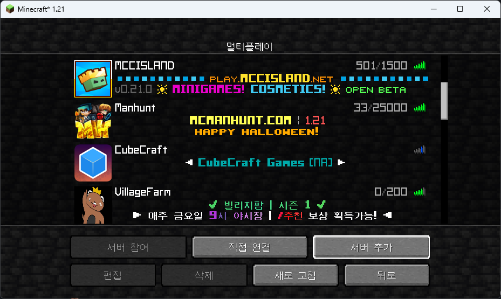

# 📩 서버 접속하기

1. **1.21** 버전의  마인크래프트를 실행합니다
2. "멀티플레이" 옵션에 들어갑니다

<figure><figcaption></figcaption></figure>

3. 서버 추가를 클릭합니다

<figure><figcaption></figcaption></figure>

4. 서버 주소에`villagef.kr`를 입력한 다음, "서버 리소스팩"을 사용으로 채크합니다

<figure><figcaption></figcaption></figure>

5. 완료를 누르고, 서버에 접속합니다
